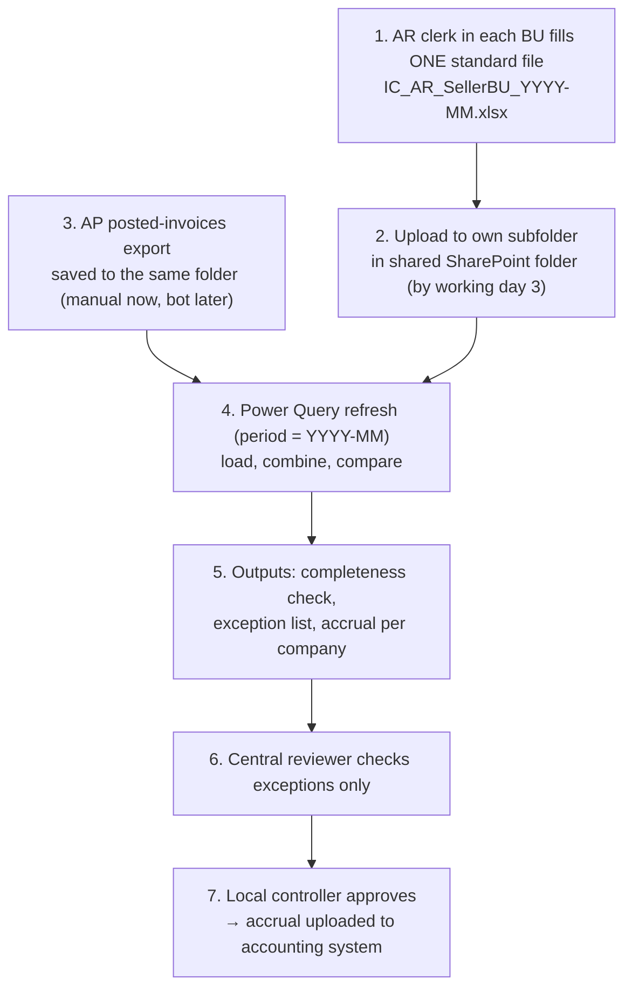
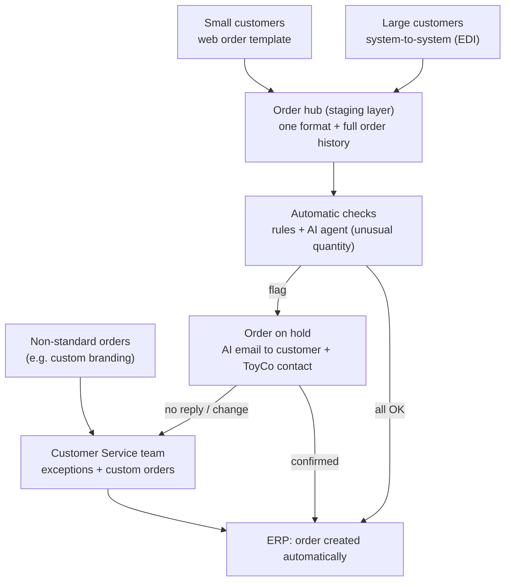
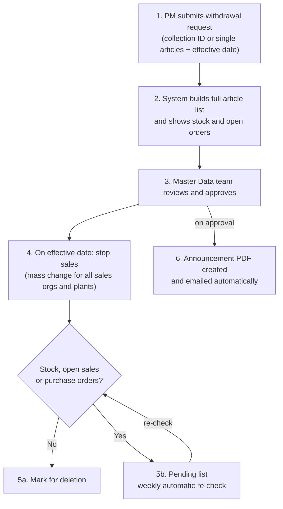
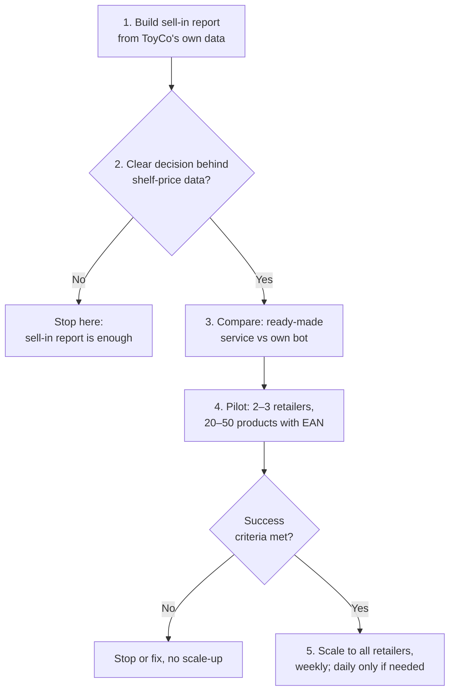

# 01 · Automation Prioritisation

*Process discovery and automation prioritisation for a fictional toy manufacturer, "ToyCo".*

> ✅ **Status:** done · **Skills:** process discovery, scoring model, automation roadmap, Power Query solution design · **Tools:** Excel, Power Query, SharePoint, RPA concepts (UiPath, Power Automate)

> 📁 **Case study series:** this is one of three parts of a case study for an **Automation Business Analyst** role (2026): [01 Automation prioritisation](../01-automation-prioritisation) · [02 Process map](../02-process-map) · [03 Task-mining analysis](../03-task-mining-analysis)
>
> **About the data:** company names, systems, people and numbers are changed, and the case is retold in my own words. The analysis, scoring and recommendations are my own work.

---

## Approach

I reviewed four ToyCo processes and asked two questions for each one:

1. **Is it a good candidate for automation?**
2. **Should the process be improved before it is automated?**

In every case the strongest result came from **fixing the input at the source first** (standard templates, clear IDs, structured channels) and then letting tools do the repetitive work, with people focusing on exceptions.

## Scoring criteria

Each process gets a score from 1 (weak) to 5 (strong). A higher score always means a better candidate. For stability and implementation risk, a high score means **stable** and **low risk**.

| Criterion | What it means |
|---|---|
| Volume / time | How many hours of manual work can be removed |
| Repeatability | How often the process runs, and how alike each run is |
| Input structure | Structured (Excel, system data) vs. unstructured (PDF, email text, websites) |
| Rule clarity | Can every decision be written as a clear rule? |
| Stability | Will the process and its systems stay the same over the next 12 months? |
| Implementation risk | Technical effort and risk of the solution breaking (5 = low risk) |
| Business value clarity | Is it clear who benefits and what decision or outcome improves? |

## Scores and ranking

| Process | Vol. | Rep. | Input | Rules | Stab. | Risk | Value | **Total** | **Rank** |
|---|---|---|---|---|---|---|---|---|---|
| IC Accruals | 4 | 4 | 5 | 5 | 5 | 4 | 5 | **32** | **1** |
| Order entry | 5 | 5 | 2 | 4 | 2 | 2 | 5 | **25** | **2** |
| Product discontinuation | 2 | 1 | 4 | 5 | 2 | 3 | 4 | **21** | **3** |
| Product price tracking | 1 | 4 | 2 | 2 | 1 | 2 | 1 | **13** | **4** |

| Rank | Process | Why | Recommended approach |
|---|---|---|---|
| 1 | IC Accruals | Structured Excel input, one clear rule, stable, same logic in all 9 business units, ~36 h/month at month-end | **Start now:** standard template + SharePoint folder + Power Query; bot later for export and upload |
| 2 | Order entry | Biggest volume (~110–300 h/month), but unstructured PDFs and a new ERP version within 9 months | **Plan with the new ERP:** EDI for large customers, web template for small ones, order hub, AI quantity checks |
| 3 | Product discontinuation | Very clear rules and high error risk, but only 8–12 requests a year | **Plan with the new ERP:** collection IDs, request form, approval, automatic mass change |
| 4 | Product price tracking | New process with unclear value, fragile websites, no EAN codes, legal risk | **Do not build a bot in this form:** sell-in report first, clarify the need, buy before build, pilot |

## Roadmap

| When | What |
|---|---|
| Now | IC Accruals steps 1–3 (template, folder, Power Query, review); sell-in report; workshop with Sales Analytics on price-tracking needs; quick fix for discontinuation (article list + standard mass change) |
| During ERP migration planning | Design the order hub, EDI standard, web template, collection IDs and the request workflow |
| After ERP go-live | Order entry wave 1 (top customers on EDI, web template); automated discontinuation workflow; IC Accruals bot for export and upload |
| Later | Order entry wave 2 and AI quantity agent; price-tracking pilot only if the need is confirmed |

> **Key message:** the process with the most hours (Order entry) is not the best place to start. IC Accruals gives a fast, low-risk result now, while the two ERP-dependent processes are designed together with the new system, so no work is done twice.

---

## Process 1 — IC Accruals (Rank 1)

**The case (in my words):** at month-end, the Accounts Payable (AP) clerk in each business unit (BU) receives an Excel report by email from the Accounts Receivable (AR) clerks of the other 8 BUs. The AP clerk compares each report with the invoices already posted. For invoices not posted yet, the AP clerk calculates the amount, fills in an Excel template and loads it into the accounting system as an accrual. Each check takes about 30 minutes.

### As-is and its problems

| Item | Today |
|---|---|
| Business units | 9 |
| Reports per BU per month | 8 (one from each other BU) |
| Checks per month | 9 × 8 = **72** |
| Time per check | ~30 minutes |
| Manual effort | **~36 hours per month**, all during month-end close |

- **No standard format:** 8 different people send their own Excel files, so every check starts with understanding a new layout.
- **Email as the data channel:** files get lost, arrive late or come in several versions.
- **The same work is done 9 times:** the comparison logic is identical in every BU.
- **Peak pressure:** all the hours fall into the busiest days of the month.

### To-be: fix first, automate second

| Step | What changes | Tool |
|---|---|---|
| 1. Standardise | One template, one file-naming rule, one shared folder | Excel, SharePoint |
| 2. Consolidate | Power Query loads all files for the month and compares them with posted invoices | Excel Power Query (or Power BI) |
| 3. Control | Completeness check, exception list, central review, local approval | Excel / Power BI report |
| 4. Automate the rest | Bot exports posted invoices and uploads accruals; automatic reminders | UiPath, Power Automate |



**Standard template (locked columns):** `Seller_BU`, `Buyer_BU` (drop-down lists, cannot be equal), `Invoice_No` (unique), `Invoice_Date` (must be inside the month), `Amount`, `Currency` (drop-down), `Description` (optional). Users can add rows but cannot rename, delete or move columns.

**File naming:** `IC_AR_<Seller_BU>_<YYYY-MM>.xlsx`, e.g. `IC_AR_TC_PL_2026-09.xlsx`. Year–month only: the process is monthly, and `YYYY-MM` sorts correctly and means the same in every country.

**Shared folder instead of email:**
```
IC_Accruals/
├── AR_Reports/
│   ├── TC_PL/   IC_AR_TC_PL_2026-09.xlsx
│   ├── TC_DE/   IC_AR_TC_DE_2026-09.xlsx
│   └── ...      (9 subfolders)
├── AP_Posted/   AP_Posted_2026-09.xlsx
└── Output/      IC_Accruals_Report.xlsx
```

### Power Query build

| Query | What it does |
|---|---|
| Period | Reads the reporting month from one input cell |
| BU_List | Master list of the 9 BU codes and the AR contact |
| AR_Files | Connects to the SharePoint folder, keeps only files for the period |
| AR_Combined | Combines all AR files into one table, adds Seller_BU from the file name |
| AP_Posted | Loads the export of IC invoices already posted in AP |
| Unposted | Invoices issued by AR but not found in AP (**Left Anti** join) |
| Amount_Mismatch | Invoices found in both, but with a different amount (**Inner** join) |
| Accrual_by_BU | Sum of unposted invoices per Buyer_BU and currency, the accrual to book |
| Completeness | Which BUs uploaded a file for the period and which did not |

Example: month filter in Power Query (M):
```
Period  = Excel.CurrentWorkbook(){[Name="Period"]}[Content]{0}[Column1],
Source  = SharePoint.Files("https://toyco.example.com/sites/Finance"),
AR_Only = Table.SelectRows(Source, each Text.StartsWith([Name], "IC_AR_")
            and Text.Contains([Name], Period) and [Extension] = ".xlsx")
```
In plain words: take all files from the Finance site, keep only the AR files for the chosen month and ignore everything else.

### Control and roles
- **Exception list:** missing file, amount mismatch AR vs AP, duplicate invoice number, invoice date outside the month, wrong BU code.
- **Roles:** AR clerk uploads by working day 3 → central reviewer clears exceptions → **local controller approves** (four-eyes principle, segregation of duties) → upload.

### Expected effect

| | Today | To-be (steps 1–3) |
|---|---|---|
| Files per month | 72 emails | 9 uploads to one folder |
| Comparisons done by people | 72 | 0 (Power Query); people review exceptions only |
| Monthly effort | ~36 hours | **~2–3 hours** for the reviewer (estimate, to confirm in a 1–2 month pilot) |
| Visibility | Scattered across mailboxes | One report: completeness, exceptions, accruals |

---

## Process 2 — Order entry (Rank 2)

**The case (in my words):** a Customer Service team of 4 people types sales orders from 250+ customers in EMEA into the ERP (SAP, transaction VA01). Orders come mostly as PDFs, sometimes as spreadsheets or plain email text. Each person gets 10–18 orders a day; one order takes 8–12 minutes. A new ERP version is planned within 9 months.

**Main problems:** 250+ different PDF layouts; most of the time is pure retyping; a bot built on today's screens would likely need to be rebuilt after the migration; the team's time goes to data entry instead of customers.

**Idea:** get structured order data **at the source** instead of teaching a bot to read hundreds of PDF layouts.

| Customer type | Channel | Who handles it |
|---|---|---|
| Large customers (high volume) | System-to-system connection (EDI) | Fully automatic; team handles exceptions only |
| Small customers | Standard order template on the ToyCo website | Fully automatic; team handles exceptions only |
| Non-standard orders (e.g. custom branding) | Separate request option on the website | A named person in Customer Service |



- **Order hub:** all channels feed one database with one format and full history. When the ERP changes, **only the hub-to-ERP connection changes**; customers notice nothing.
- **Automatic rule checks:** article active, credit limit, availability, price and minimum quantity, duplicates.
- **AI agent for unusual quantities:** compares each order with the customer's history and seasonality (a big order in October may be normal, the same order in March may not). Flagged orders are put on hold and the customer gets an approved-template email asking to confirm. The AI never changes an order by itself, and every flag is logged so thresholds can be tuned.
- **Timing:** design now, build with the new ERP, then wave 1 (top customers on EDI + web template), then wave 2.

---

## Process 3 — Product discontinuation (Rank 3)

**The case (in my words):** a Master Data team of 3 people gets 8–12 requests a year from Product Managers to discontinue a single article or a whole series (up to 80 articles). For every sales organisation and plant they change material settings, block the material if there is no stock and no open orders, and email a discontinuation PDF.

**Scale of one large request (example):** with 5 sales organisations and 5 plants, 80 articles mean up to **~2,400 setting changes, ~2,400 condition checks and ~800 blocks**, all by hand.

**Main problems:** the PM sends a series name, not an article list; thousands of manual changes; rare process with no routine; **hidden gap:** articles that cannot be blocked yet (stock or open orders) may stay unblocked for good.



- **Collection ID for every article** (e.g. *Space Rangers = 4810*) in a standard ERP field, so the system knows exactly which articles belong to a series.
- **Request form** for the PM (collection or single articles, future effective date, reason). The PM does not change master data directly: the Master Data team keeps control through approval (data governance, separation of duties).
- **Two-stage execution:** stop sales on the effective date; mark for deletion only when conditions allow; a **pending list re-checked every week**, with a report after e.g. 90 days so nothing is forgotten.
- **Quick win now:** PMs send article numbers instead of a series name, and the team uses the ERP's standard mass-change function.

---

## Process 4 — Product price tracking (Rank 4)

**The case (in my words):** Sales Analytics wants to track ToyCo product prices on the websites of 8 retailers for 250 products, weekly at first and daily "if the results are satisfactory".

| | Weekly | Daily |
|---|---|---|
| Price checks per run | 8 × 250 = **2,000** | 2,000 |
| Price checks per month | ~8,700 | ~44,000–60,000 |
| Manual effort (~1 min per check) | ~33 hours per run | ~33 hours **every day**, not possible |

**My recommendation: do not build a bot in this form.**

| Blocker | What it means in practice |
|---|---|
| No clear decision behind the data | No user, no action and no definition of "satisfactory results" |
| High and ongoing cost | Websites change and block bots; this is permanent maintenance, not a one-off build |
| Unreliable product matching | No EAN codes; products must be matched by name across websites |
| "Price" is not one number | Promotions, out-of-stock items, marketplace sellers, variants, currencies and VAT |
| Legal risk | Some websites forbid automated data collection; producers generally may not impose resale prices in the EU |



- **Step 1:** a sell-in report (e.g. in Power BI) from ToyCo's own sales data: volume and net price per retailer and article. No bot and no product matching needed.
- **Step 2:** a workshop to agree which decision the shelf-price data should support.
- **Step 3:** **buy before you build.** For a small scope, a ready-made price-monitoring service is very likely cheaper and safer.
- **Step 4:** a 6–8 week pilot with clear success criteria (e.g. ≥95% correct product match and at least one real decision based on the data).
- **Later option:** combining sell-in and shelf price shows the **retailer's margin**, a much stronger insight than shelf price alone.

---
[← Back to all projects](../README.md)
