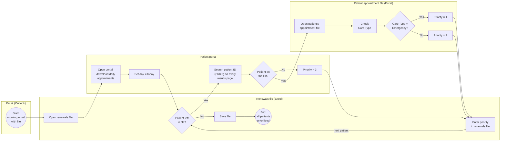

# 02 · Process Map (BPMN): Subscription Renewal Prioritisation

*BPMN 2.0 (simplified) swimlane map of a manual process at a fictional private clinic.*

> ✅ **Status:** done · **Skills:** BPMN process mapping, waste analysis, to-be design · **Tools:** BPMN 2.0, draw.io, Mermaid

> 📁 **Case study series:** this is one of three parts of a case study for an **Automation Business Analyst** role (2026): [01 Automation prioritisation](../01-automation-prioritisation) · [02 Process map](../02-process-map) · [03 Task-mining analysis](../03-task-mining-analysis)
>
> **About the data:** company names, systems, people and numbers are changed, and the case is retold in my own words. The analysis, scoring and recommendations are my own work.

---

## The process (in my words)

Every morning an employee gets an email with an Excel file listing patients whose subscription needs to be renewed. For each patient, the employee checks the clinic's patient portal to see if the patient has an appointment today. Patients with an appointment get a higher priority, and emergency appointments get the highest. The priority is written back into the file.

**Priority rules:**
- **1:** the patient has an appointment today and the care type is *Emergency*
- **2:** the patient has an appointment today, but not an emergency
- **3:** the patient is not on today's appointment list

## Process map

Lanes = the systems the employee works in. Diamonds = decisions (exclusive gateways).

> The original map was drawn in **draw.io** with full BPMN symbols. This version is written in Mermaid, so GitHub can show it directly.

## Weak points of the current process

| Weak point | Why it matters |
|---|---|
| **The same search is repeated for every patient** | The appointment list is the same all morning, but it is searched again (Ctrl+F, page by page) for each patient |
| **Manual search across many result pages** | Easy to miss a patient on another page, so a patient may wrongly get priority 3 |
| **A separate file must be opened for every match** | Many clicks just to read one field (Care Type) |
| **Priority is typed by hand** | Typing errors; no record of how the priority was decided |
| **The whole process depends on one person each morning** | No backup if that person is absent |

## Improvement idea (to-be)

The rules are clear and the inputs are structured, so this is a good automation candidate. The key change is to **read the appointment list once** instead of searching it for every patient:

1. Download today's appointments **once** (including Care Type) into one table.
2. Match all patients from the renewals file against this table in one step (lookup on patient ID, e.g. Power Query merge or XLOOKUP).
3. Apply the priority rules automatically (1 / 2 / 3).
4. A person reviews only unclear cases (e.g. patient ID not found or duplicated).
5. Later, an RPA bot can do the portal download and save the file, so the whole run starts by itself every morning.

## Questions for the process owner

- How many patients are in the file on a typical day, and how long does the process take today?
- Can the portal export the whole day's appointments, including Care Type, in one file?
- Is the patient ID the same in the renewals file and in the portal?
- What happens with the priorities later, who uses them and when?

---
[← Back to all projects](../README.md)
