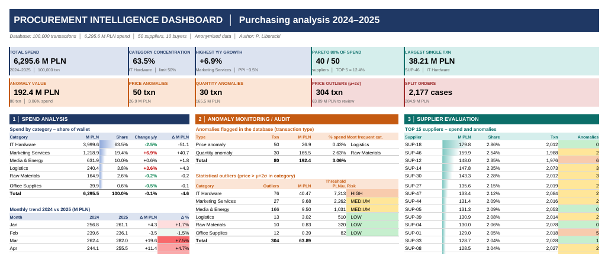
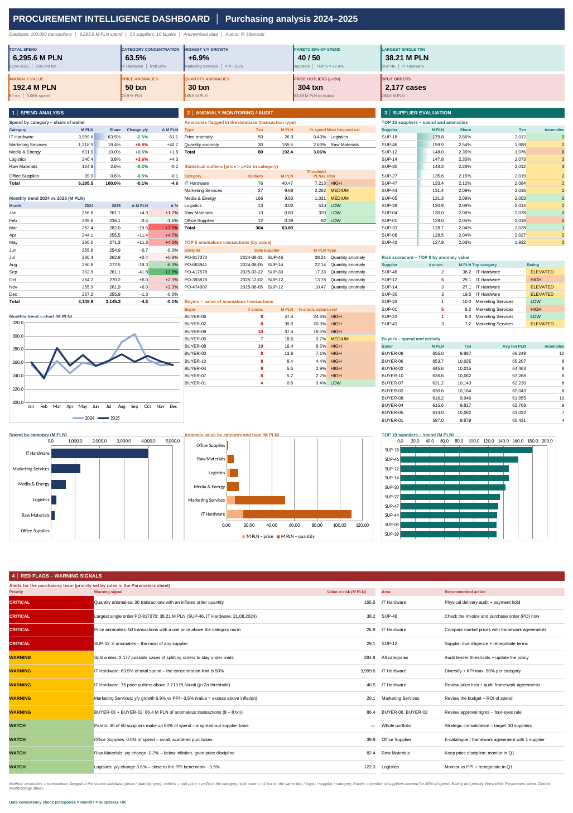

# 04 · Procurement Intelligence Dashboard

> ✅ **Status:** done · **Tools:** Excel (formulas, conditional formatting, charts) · **Data:** 100,000 purchase transactions, 2024–2025, anonymised

## Business problem
A company spends over 6 billion PLN in two years across 50 suppliers and 10 buyers. The purchasing team needs to answer four questions quickly:

1. **Where does the money go?** (spend by category, trend year on year)
2. **Which transactions look wrong?** (price and quantity anomalies, statistical outliers)
3. **Which suppliers and buyers need attention?** (risk scorecard)
4. **What should we do first?** (a ranked list of red flags with actions)

## What this project shows
- Turning a large transaction file into a **one-screen dashboard** for a manager
- **Anomaly detection:** price outliers above the category mean + 2 standard deviations (μ+2σ), split orders, flagged price and quantity anomalies
- **Supplier evaluation:** Pareto analysis, TOP 15 ranking, risk rating based on the number of anomalies
- **Red flags** with a priority (critical / warning / watch) and a recommended action for each one
- **A model that updates itself:** every number on the dashboard is a formula. Change a threshold in the `Parameters` sheet and all ratings, priorities and texts update

## Workbook structure

| Sheet | What is inside |
|---|---|
| `Dashboard` | The one-screen view: 10 KPI tiles, 3 analysis sections, 4 charts, red flags |
| `Methodology` | Definitions and rules, in plain language |
| `Parameters` | Thresholds and benchmarks you can change (yellow cells) |
| `Data_Anomalies` | The 80 flagged transactions (value = quantity × unit price) |
| `Data_Suppliers` | 50 suppliers: spend, transactions, anomalies, rating, cumulative share for Pareto |
| `Data_Buyers` | 10 buyers: spend, transactions, anomalies, risk level |
| `Data_Categories` / `Data_Months` | Spend by category and by month, 2024 vs 2025 |
| `Data_Outliers` | μ+2σ outliers per category, split-order totals |
| `Calculations` | Helper calculations and a **data check**: spend by category, by month and by supplier must match |

## How I built it
1. **Looked at the raw data first:** columns, date range, categories, missing values.
2. **Aggregated** the 100,000 rows into small tables: by category, month, supplier and buyer.
3. **Defined the anomaly rules:** μ+2σ per category for price outliers; "more than one transaction on the same day, same buyer, same supplier, same category" for split orders.
4. **Built the calculations with formulas** (`SUMIFS`, `COUNTIFS`, `INDEX/MATCH`, `LARGE`). Rankings sort themselves, so nothing is typed in by hand.
5. **Added a consistency check:** the three spend totals must agree. If they do not, the dashboard shows "CHECK DATA".
6. **Designed for a fast read:** KPI tiles at the top, colour rules (red = act, yellow = watch, green = fine), and the red-flag list at the bottom.

## Key findings (anonymised data)
- **One category = 63.5% of all spend**, above a 50% concentration limit
- **80 flagged transactions** worth **3.06% of spend**. Quantity anomalies make up most of that value
- The largest single order alone is worth **38.2 M PLN**
- **40 of 50 suppliers** are needed to cover 80% of spend, so the supplier base is very spread out
- Marketing services grew **+6.9% year on year** vs inflation (PPI) of about **3.5%**
- **2,177 possible split orders**, a sign that orders may be divided to stay under tender limits

## Full dashboard

Click to see the whole page

## What I would do next
- Connect the dashboard directly to the raw transaction file with Power Query, so a new month is one click
- Add filters (year, category, buyer)
- Track whether the red flags were closed and how much money that saved

> **About the data:** supplier names, buyer names and order numbers are changed, and PLN values are transformed. Shares, year-on-year changes and transaction counts are kept, so the conclusions stay the same.

---
[← Back to all projects](../README.md)
