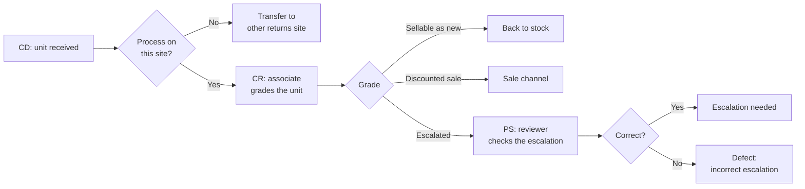
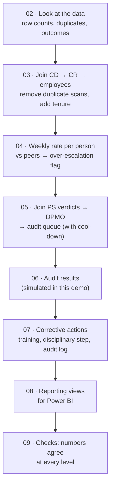

# 07 · Defect Rate & DPMO: Incorrect Escalations in a Returns Process

> ✅ **Status:** SQL pipeline done · Power BI report: build guide ready · **Tools:** SQL (PostgreSQL, written to run on Amazon Redshift), Power BI · **Data:** synthetic, 458,000 graded units over 12 weeks

## Business problem

In a customer-returns operation, every returned unit is graded by an associate. If the associate is not sure what to do with a unit, they **escalate** it to a review team. Each escalation costs time twice: once when the unit is escalated and once when a reviewer checks it.

Nobody had measured how many escalations were actually needed. Everyone assumed the problem was too small to fix. When I joined the data from the three process stages, **about 25% of all escalations turned out to be incorrect**: the unit could have been graded straight away.

The goal: find who escalates too much, check if those escalations were wrong, act on it in a fair and consistent way, and give management one report to follow the progress.

> **The real project behind this:** I led this programme in a large returns operation. The incorrect-escalation rate went from **25% to 2.06% in 11 weeks** (~$80,000 annual savings). This repository rebuilds the logic end to end on **synthetic data**. All table names, logins and numbers here are invented.

## The process and the data

| Stage | Table | What happens | Key columns |
|---|---|---|---|
| **CD** – receiving dock | `cd_receiving` | The unit is received and routed: processed on this site (SITE_A) or transferred to another returns site (SITE_B) | `unit_id`, `received_ts`, `routing_decision` |
| **CR** – condition review | `cr_grading` | An associate grades the unit: **sellable as new**, **discounted sale**, or **escalated** | `unit_id`, `login`, `grade_ts`, `grade_outcome` |
| **PS** – escalation review | `ps_review` | A reviewer checks each escalated unit: **correct** or **incorrect** escalation | `unit_id`, `ps_login`, `verdict` |
| Employees | `employees`, `managers` | Manager, shift, first day in the process, permanent or agency | `login`, `manager_login`, `process_start_date` |



## The rules

| Rule | Definition |
|---|---|
| **Veteran / new** | More than 5 weeks in the CR process = veteran |
| **Escalation rate** | Escalations ÷ units processed, per associate per week |
| **Peer escalation rate** | The same rate for **everyone else** that week (the associate is left out of their own benchmark) |
| **Over-escalation flag** | Own rate is **at least 10% higher** than the peer rate |
| **DPMO** | Incorrect escalations ÷ **all** units processed × 1,000,000 (all units, not only escalations) |
| **Audit trigger** | Over-escalation flag **and** DPMO above **5,000** → live audit at PS the following week |
| **Live audit** | An auditor stands with the associate and checks all their escalations as they happen |
| **After a failed audit** | Extra training + next disciplinary step + entry in the internal audit log; follow-up audit 2 weeks later |
| **Repeat cases** | 1st failed audit: documented coaching · 2nd: first written warning · 3rd: final written warning |
| **Cool-down** | After an audit, the person gets 2 weeks to apply the training before they can be audited again |

## How I built it



| File | What it does |
|---|---|
| [`00_schema.sql`](sql/00_schema.sql) | Creates the tables |
| [`01_seed_synthetic_data.sql`](sql/01_seed_synthetic_data.sql) | Creates the synthetic data (PostgreSQL only) |
| [`02_explore.sql`](sql/02_explore.sql) | **Looks at the data first:** sample rows, row counts vs distinct units (finds duplicates), outcome mix |
| [`03_base_units.sql`](sql/03_base_units.sql) | Joins the three stages. Keeps only units processed on this site, keeps the **latest grade** when a unit was scanned twice (`ROW_NUMBER`), adds manager, shift and tenure |
| [`04_escalation_flags.sql`](sql/04_escalation_flags.sql) | Weekly escalation rate per person vs **everyone else** (window functions), 10% over-escalation flag |
| [`05_ps_join_dpmo.sql`](sql/05_ps_join_dpmo.sql) | Joins the PS verdicts (deduplicated), calculates DPMO, builds the audit queue with a **recursive CTE** for the cool-down rule |
| [`06_simulate_audit_results.sql`](sql/06_simulate_audit_results.sql) | Stand-in for the auditors' records (synthetic) |
| [`07_corrective_actions.sql`](sql/07_corrective_actions.sql) | Training, disciplinary step by history, audit-log entry, follow-up week |
| [`08_reporting_views.sql`](sql/08_reporting_views.sql) | Views for the report: department, shift, manager, segments, top offenders, trend, actions |
| [`09_checks.sql`](sql/09_checks.sql) | Final checks: totals agree between every level |

**How I worked, step by step:**
1. **Looked at the data before writing the big query:** sample rows, row counts and distinct IDs. This showed duplicate scans in CR and double reviews in PS.
2. **Built the query in small stages** (CTEs), one join at a time.
3. **Checked row counts after every join.** A bad join quietly duplicates rows and makes every rate wrong.
4. **Checked the result against a trusted number:** total incorrect escalations in the report = distinct incorrect verdicts in PS.
5. **Calculated ratios at the right level.** DPMO for a shift is total defects ÷ total units for that shift, never the average of personal DPMOs.

## Results (synthetic data)

| Week | Units processed | Escalations | Incorrect | Incorrect share | DPMO |
|---|---|---|---|---|---|
| 1 | 35,141 | 1,734 | 447 | **25.8%** | **12,720** |
| 3 | 37,216 | 1,856 | 480 | 25.9% | 12,898 |
| 4 *(programme starts)* | 37,332 | 1,740 | 394 | 22.6% | 10,554 |
| 6 | 38,650 | 1,712 | 254 | 14.8% | 6,572 |
| 8 | 39,592 | 1,525 | 120 | 7.9% | 3,031 |
| 10 | 38,961 | 1,501 | 26 | 1.7% | 667 |
| 12 | 39,453 | 1,451 | 22 | **1.5%** | **558** |

**What the data showed (weeks 1–3):**
- **10 people out of 68 caused 63% of all incorrect escalations.** The problem was concentrated, so a targeted audit made more sense than retraining everyone.
- **Night shift DPMO was ~50% higher than day shift** in week 1 (15,036 vs 10,263).
- **Two managers' teams had DPMO above 20,000**, more than five times the best team.
- **Veterans had a higher DPMO than new associates** (13,051 vs 8,926), so the problem was not "new people who don't know the process yet". It was habits.
- Over 12 weeks: **51 live audits** of **23 people**; most failed at the first audit, repeat cases got stricter steps.

All 6 checks in `09_checks.sql` pass: the department, shift and manager views add up to the same totals as the source tables.

## Power BI report for management

The report reads the views from `08_reporting_views.sql` (or the CSV exports in [`data/`](data)). All ratios are already calculated in SQL, so the report needs no calculated measures. Power BI is used for **data modelling, publication and visualization**.

| Page | What it shows |
|---|---|
| 1 · Overview | KPI cards (department DPMO, incorrect escalations, people above threshold, audits); DPMO trend with the 5,000 threshold line |
| 2 · Shifts & managers | DPMO by shift and by manager, week by week |
| 3 · Top offenders | Ranked table: DPMO for the period and the last 4 weeks, audits, current disciplinary step |
| 4 · Incorrect escalations trend | Weekly count, change vs the previous week, cumulative total |
| 5 · Corrective actions | Audit log: result, action, disciplinary step, follow-up week |

📄 Step-by-step build: [`dashboards/POWER-BI-GUIDE.md`](dashboards/POWER-BI-GUIDE.md)

## How to run it

```bash
createdb dpmo
cd sql
psql -d dpmo -f run_all.sql
```
Runs in about a minute on PostgreSQL 16. The analysis files (`02`–`09`) use standard SQL (CTEs, window functions, `CASE`), so they also run on Amazon Redshift; the only change needed is noted in a comment (date difference).

## What I would do next
- Add the **cost of one incorrect escalation** to show savings in money, week by week
- Send the report automatically every Monday with a scheduled refresh
- Track whether people stay below the threshold after the follow-up audit (relapse rate)

---
[← Back to all projects](../README.md)
